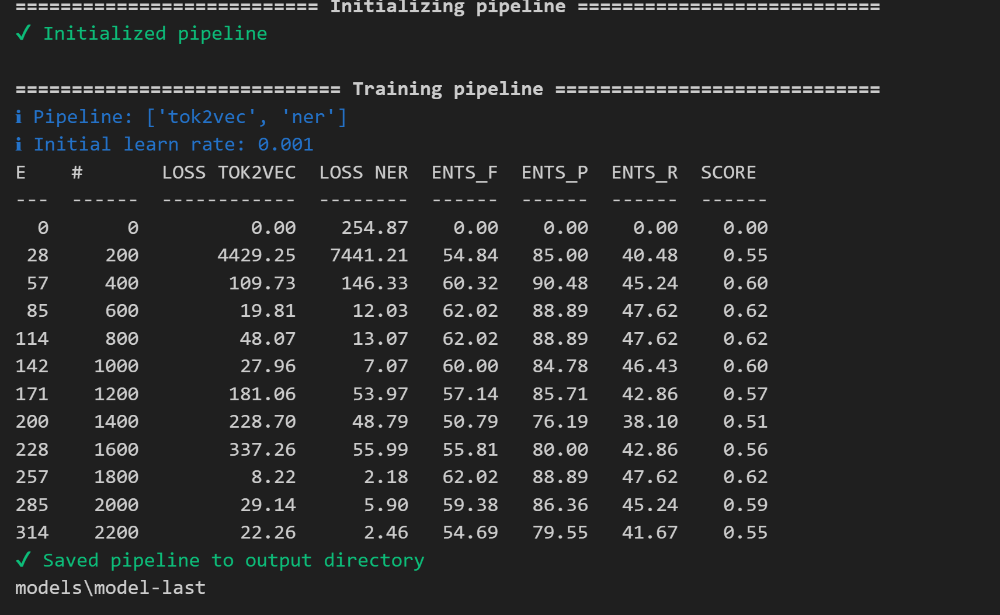

# Lab Report Digitization and Structured Data Extraction

[cite_start]This project is a comprehensive system designed to automatically extract and digitize patient details and lab test results from various formats of medical reports (PDFs, JPGs, PNGs) into a structured JSON format[cite: 13, 14, 19]. [cite_start]It features a machine learning component that learns from user corrections, improving its accuracy over time[cite: 20, 8].


*User interface for correcting and verifying extracted lab report data.*

---
## Objective
The primary goal is to build an intelligent pipeline that can:
* [cite_start]Take a lab report file (PDF or image) as input[cite: 19, 150].
* [cite_start]Recognize and extract key information (patient details, test names, values, units, reference ranges)[cite: 19, 151].
* [cite_start]Convert the extracted data into a structured JSON format[cite: 19, 152].
* [cite_start]Provide a user-friendly interface for verifying and correcting the data[cite: 7, 74, 153].
* [cite_start]Continuously learn from user-provided corrections to improve the extraction model[cite: 8, 86, 120].

---
## Key Features
* [cite_start]**Multi-Format Input**: Accepts lab reports in PDF, JPG, or PNG formats[cite: 22].
* [cite_start]**Image Preprocessing**: Automatically converts PDFs to images, cleans up scanned files (deskewing, denoising), and enhances them for optimal OCR performance[cite: 22, 42, 43].
* [cite_start]**OCR & Text Extraction**: Utilizes Tesseract for accurate text extraction from images, capturing word positions (bounding boxes) for contextual analysis[cite: 22, 53, 54].
* [cite_start]**Hybrid Extraction Model**: Employs a spaCy-based NER model for intelligent data extraction and falls back on a robust rule-based system for reliability[cite: 98, 105, 108].
* [cite_start]**Human-in-the-Loop UI**: A simple web interface allows users to review, edit, and confirm the extracted data, ensuring high accuracy[cite: 7, 74].
* [cite_start]**Continuous Learning**: User corrections are saved and can be used to retrain and improve the machine learning model over time[cite: 8, 86, 125].
* [cite_start]**REST API**: A FastAPI-based backend provides endpoints to upload reports and save corrected data programmatically[cite: 9, 24, 110].
* [cite_start]**Performance Evaluation**: Includes a script to measure the model's performance using metrics like Precision, Recall, and F1-Score against a ground-truth dataset[cite: 129, 130].

---
## How It Works
The system follows a multi-stage pipeline:

1.  **File Upload**: A user uploads a lab report via the web interface.
2.  [cite_start]**Preprocessing (Module 1)**: The input file is converted into cleaned, high-resolution images[cite: 42, 51].
3.  [cite_start]**OCR & Tokenization (Module 2)**: Tesseract OCR reads the text and its coordinates from the cleaned images[cite: 53, 59].
4.  [cite_start]**Inference (Module 6)**: The trained spaCy NER model attempts to extract entities from the tokenized text[cite: 98, 102].
5.  [cite_start]**Fallback Mechanism**: If the ML model's output is insufficient, the system automatically falls back to a dynamic **Rule-Based Extraction (Module 3)** method to ensure data is captured[cite: 105].
6.  [cite_start]**Human Review (Module 4)**: The extracted data is displayed on a web form where a user can make corrections and save the final, accurate version[cite: 74, 77].
7.  [cite_start]**Data Storage (Module 8)**: The corrected data is saved, creating a valuable dataset for retraining the ML model[cite: 120, 124].


*Training progress of the spaCy NER model.*

---
## Tech Stack
* [cite_start]**Backend**: Python, FastAPI [cite: 24]
* [cite_start]**OCR Engine**: Tesseract [cite: 24]
* [cite_start]**Machine Learning**: spaCy, Scikit-learn [cite: 24, 87]
* [cite_start]**Image Processing**: OpenCV, PyMuPDF [cite: 24, 43]
* **Core Libraries**: Pandas, NumPy

---
## Project Structure

Markdown

# Lab Report Digitization and Structured Data Extraction

[cite_start]This project is a comprehensive system designed to automatically extract and digitize patient details and lab test results from various formats of medical reports (PDFs, JPGs, PNGs) into a structured JSON format[cite: 13, 14, 19]. [cite_start]It features a machine learning component that learns from user corrections, improving its accuracy over time[cite: 20, 8].


*User interface for correcting and verifying extracted lab report data.*

---
## Objective
The primary goal is to build an intelligent pipeline that can:
* [cite_start]Take a lab report file (PDF or image) as input[cite: 19, 150].
* [cite_start]Recognize and extract key information (patient details, test names, values, units, reference ranges)[cite: 19, 151].
* [cite_start]Convert the extracted data into a structured JSON format[cite: 19, 152].
* [cite_start]Provide a user-friendly interface for verifying and correcting the data[cite: 7, 74, 153].
* [cite_start]Continuously learn from user-provided corrections to improve the extraction model[cite: 8, 86, 120].

---
## Key Features
* [cite_start]**Multi-Format Input**: Accepts lab reports in PDF, JPG, or PNG formats[cite: 22].
* [cite_start]**Image Preprocessing**: Automatically converts PDFs to images, cleans up scanned files (deskewing, denoising), and enhances them for optimal OCR performance[cite: 22, 42, 43].
* [cite_start]**OCR & Text Extraction**: Utilizes Tesseract for accurate text extraction from images, capturing word positions (bounding boxes) for contextual analysis[cite: 22, 53, 54].
* [cite_start]**Hybrid Extraction Model**: Employs a spaCy-based NER model for intelligent data extraction and falls back on a robust rule-based system for reliability[cite: 98, 105, 108].
* [cite_start]**Human-in-the-Loop UI**: A simple web interface allows users to review, edit, and confirm the extracted data, ensuring high accuracy[cite: 7, 74].
* [cite_start]**Continuous Learning**: User corrections are saved and can be used to retrain and improve the machine learning model over time[cite: 8, 86, 125].
* [cite_start]**REST API**: A FastAPI-based backend provides endpoints to upload reports and save corrected data programmatically[cite: 9, 24, 110].
* [cite_start]**Performance Evaluation**: Includes a script to measure the model's performance using metrics like Precision, Recall, and F1-Score against a ground-truth dataset[cite: 129, 130].

---
## How It Works
The system follows a multi-stage pipeline:

1.  **File Upload**: A user uploads a lab report via the web interface.
2.  [cite_start]**Preprocessing (Module 1)**: The input file is converted into cleaned, high-resolution images[cite: 42, 51].
3.  [cite_start]**OCR & Tokenization (Module 2)**: Tesseract OCR reads the text and its coordinates from the cleaned images[cite: 53, 59].
4.  [cite_start]**Inference (Module 6)**: The trained spaCy NER model attempts to extract entities from the tokenized text[cite: 98, 102].
5.  [cite_start]**Fallback Mechanism**: If the ML model's output is insufficient, the system automatically falls back to a dynamic **Rule-Based Extraction (Module 3)** method to ensure data is captured[cite: 105].
6.  [cite_start]**Human Review (Module 4)**: The extracted data is displayed on a web form where a user can make corrections and save the final, accurate version[cite: 74, 77].
7.  [cite_start]**Data Storage (Module 8)**: The corrected data is saved, creating a valuable dataset for retraining the ML model[cite: 120, 124].


*Training progress of the spaCy NER model.*

---
## Tech Stack
* [cite_start]**Backend**: Python, FastAPI [cite: 24]
* [cite_start]**OCR Engine**: Tesseract [cite: 24]
* [cite_start]**Machine Learning**: spaCy, Scikit-learn [cite: 24, 87]
* [cite_start]**Image Processing**: OpenCV, PyMuPDF [cite: 24, 43]
* **Core Libraries**: Pandas, NumPy

---
## Project Structure
.
├── app.py                  # FastAPI application with API endpoints for upload and save.
├── main_processor.py       # Core data processing pipeline (preprocessing, OCR, extraction).
├── evaluate.ipynb          # Jupyter notebook to evaluate the model's accuracy.
├── index.html              # Frontend for the human-in-the-loop UI.
├── models/model-best/      # Directory for the trained spaCy model.
└── project_data/
├── raw_input/          # Stores uploaded lab reports.
├── processed_images/   # Stores cleaned images after preprocessing.
├── tokens/             # Stores OCR output (tokens and bounding boxes).
├── extracted_reports/      # Stores JSON output from the rule-based system.
├── pending_reports/    # Stores reports awaiting user verification.
└── training_data_corrections/ # Stores user-corrected JSON files for retraining.

---
## Setup and Usage

### 1. Installation
Clone the repository and install the required dependencies. It's recommended to use a virtual environment.
```bash
# It is assumed you have Tesseract installed on your system
pip install -r requirements.txt


Markdown

# Lab Report Digitization and Structured Data Extraction

[cite_start]This project is a comprehensive system designed to automatically extract and digitize patient details and lab test results from various formats of medical reports (PDFs, JPGs, PNGs) into a structured JSON format[cite: 13, 14, 19]. [cite_start]It features a machine learning component that learns from user corrections, improving its accuracy over time[cite: 20, 8].


*User interface for correcting and verifying extracted lab report data.*

---
## Objective
The primary goal is to build an intelligent pipeline that can:
* [cite_start]Take a lab report file (PDF or image) as input[cite: 19, 150].
* [cite_start]Recognize and extract key information (patient details, test names, values, units, reference ranges)[cite: 19, 151].
* [cite_start]Convert the extracted data into a structured JSON format[cite: 19, 152].
* [cite_start]Provide a user-friendly interface for verifying and correcting the data[cite: 7, 74, 153].
* [cite_start]Continuously learn from user-provided corrections to improve the extraction model[cite: 8, 86, 120].

---
## Key Features
* [cite_start]**Multi-Format Input**: Accepts lab reports in PDF, JPG, or PNG formats[cite: 22].
* [cite_start]**Image Preprocessing**: Automatically converts PDFs to images, cleans up scanned files (deskewing, denoising), and enhances them for optimal OCR performance[cite: 22, 42, 43].
* [cite_start]**OCR & Text Extraction**: Utilizes Tesseract for accurate text extraction from images, capturing word positions (bounding boxes) for contextual analysis[cite: 22, 53, 54].
* [cite_start]**Hybrid Extraction Model**: Employs a spaCy-based NER model for intelligent data extraction and falls back on a robust rule-based system for reliability[cite: 98, 105, 108].
* [cite_start]**Human-in-the-Loop UI**: A simple web interface allows users to review, edit, and confirm the extracted data, ensuring high accuracy[cite: 7, 74].
* [cite_start]**Continuous Learning**: User corrections are saved and can be used to retrain and improve the machine learning model over time[cite: 8, 86, 125].
* [cite_start]**REST API**: A FastAPI-based backend provides endpoints to upload reports and save corrected data programmatically[cite: 9, 24, 110].
* [cite_start]**Performance Evaluation**: Includes a script to measure the model's performance using metrics like Precision, Recall, and F1-Score against a ground-truth dataset[cite: 129, 130].

---
## How It Works
The system follows a multi-stage pipeline:

1.  **File Upload**: A user uploads a lab report via the web interface.
2.  [cite_start]**Preprocessing (Module 1)**: The input file is converted into cleaned, high-resolution images[cite: 42, 51].
3.  [cite_start]**OCR & Tokenization (Module 2)**: Tesseract OCR reads the text and its coordinates from the cleaned images[cite: 53, 59].
4.  [cite_start]**Inference (Module 6)**: The trained spaCy NER model attempts to extract entities from the tokenized text[cite: 98, 102].
5.  [cite_start]**Fallback Mechanism**: If the ML model's output is insufficient, the system automatically falls back to a dynamic **Rule-Based Extraction (Module 3)** method to ensure data is captured[cite: 105].
6.  [cite_start]**Human Review (Module 4)**: The extracted data is displayed on a web form where a user can make corrections and save the final, accurate version[cite: 74, 77].
7.  [cite_start]**Data Storage (Module 8)**: The corrected data is saved, creating a valuable dataset for retraining the ML model[cite: 120, 124].


*Training progress of the spaCy NER model.*

---
## Tech Stack
* [cite_start]**Backend**: Python, FastAPI [cite: 24]
* [cite_start]**OCR Engine**: Tesseract [cite: 24]
* [cite_start]**Machine Learning**: spaCy, Scikit-learn [cite: 24, 87]
* [cite_start]**Image Processing**: OpenCV, PyMuPDF [cite: 24, 43]
* **Core Libraries**: Pandas, NumPy

---
## Project Structure
.
├── app.py                  # FastAPI application with API endpoints for upload and save.
├── main_processor.py       # Core data processing pipeline (preprocessing, OCR, extraction).
├── evaluate.ipynb          # Jupyter notebook to evaluate the model's accuracy.
├── index.html              # Frontend for the human-in-the-loop UI.
├── models/model-best/      # Directory for the trained spaCy model.
└── project_data/
├── raw_input/          # Stores uploaded lab reports.
├── processed_images/   # Stores cleaned images after preprocessing.
├── tokens/             # Stores OCR output (tokens and bounding boxes).
├── final_reports/      # Stores JSON output from the rule-based system.
├── pending_reports/    # Stores reports awaiting user verification.
└── training_data_corrections/ # Stores user-corrected JSON files for retraining.


---
## Setup and Usage

### 1. Installation
Clone the repository and install the required dependencies. It's recommended to use a virtual environment.
```bash
# It is assumed you have Tesseract installed on your system
pip install -r requirements.txt
(Note: A requirements.txt file would need to be created from the project imports.)
```
2. Run the Server
Start the FastAPI application using Uvicorn.

Bash

uvicorn app:app --reload
The application will be available at http://127.0.0.1:8000.

3. Using the Application
Upload: Open your web browser to http://127.0.0.1:8000. Use the UI to upload a lab report file (PDF, JPG, or PNG).

Verify & Correct: The system will process the file and display the extracted data in a form. Review the fields, make any necessary corrections, add or delete rows, and click "Save Corrected Data".

Saved: The corrected data is saved to the project_data/training_data_corrections/ directory, ready to be used for future model training.

Confirmation message after saving corrected data.

# Evaluation
The evaluate.ipynb notebook measures the performance of the extraction pipeline. It processes a set of test files, compares the extracted results against hand-corrected "ground truth" files, and calculates precision, recall, and F1-score.

